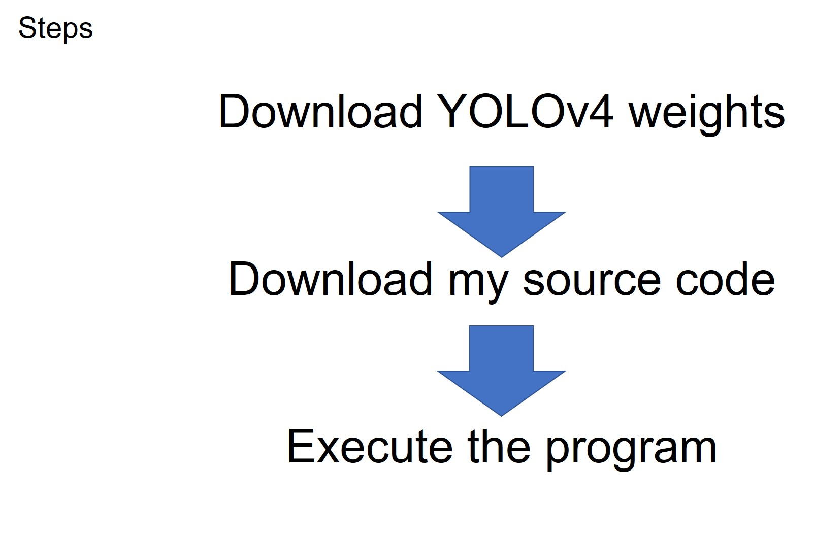
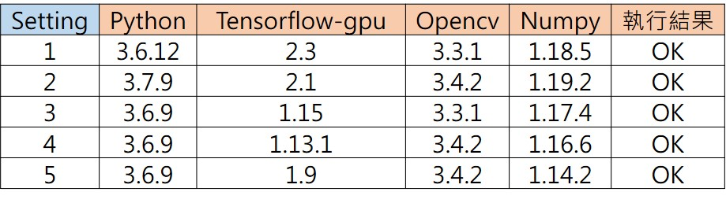

# Hands on YOLO_v4 in 10 minutes
●這是不用build Darknet，直接轉換YOLO v4 weights成Tensorflow CKPT檔案並執行即時物件偵測的[教學](https://youtu.be/C9PKhIlZTYk)

●對於Video streaming不熟悉的，可以先看此[教學](https://www.youtube.com/watch?v=96o4QcuVU4U)

●以下的程式版本是我實際跑過OK與NG的

●我參考了此程式[來源](https://github.com/rrddcc/YOLOv4_tensorflow)

●流程圖如下:

■This ia a [tutorial](https://youtu.be/C9PKhIlZTYk) of hands-on YOLO v4 in 10 minutes

■If you are interested in video streaming, welcome to my another [tutorial](https://www.youtube.com/watch?v=96o4QcuVU4U)

■Successful executions are done by different versions shown below

■The flowchart is shown below

■I refer to the source code from [here](https://github.com/rrddcc/YOLOv4_tensorflow)

